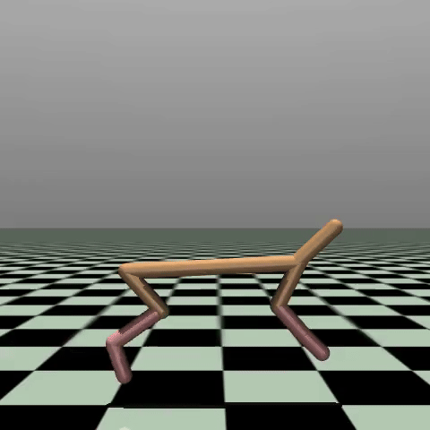

# RL_Course_DHBW

# Projekt: Robuste Roboter-Steuerung mit Deep Reinforcement Learning

Dieses Projekt implementiert einen Soft Actor-Critic (SAC) Agenten, um simulierte Roboter in den [Gymnasium](https://gymnasium.farama.org/) (ehemals OpenAI Gym) Umgebungen zu steuern.

**Trainingsfokus:** Training des **HalfCheetah-v5** Roboters, um eine robuste Laufbewegung zu erlernen.

Mit folgendem Resultat:


## Projektstruktur

- `HalfCheetah_Training.ipynb`: Das Haupt-Jupyter-Notebook für das Training des HalfCheetah-Agenten, das den gesamten Prozess von der Umgebungseinrichtung bis zur Auswertung enthält.
- `requirements.txt`: Liste der notwendigen Python-Pakete.
- `trained_sac_model`: Verzeichnis zum Speichern der trainierten HalfCheetah-Modelle (Actor-, Critic- und Alpha-Parameter).
- `halfcheetah_environment_videos`: Verzeichnis, in dem Evaluationsvideos des trainierten Agenten gespeichert werden.

## Einrichtung

1.  **Voraussetzungen:** Stellen Sie sicher, dass Sie Python 3.8+ installiert haben. Für optimale Leistung wird eine PyTorch-Installation mit GPU (CUDA) oder Apple MPS-Unterstützung empfohlen.

2.  **Paketinstallation:**

    Installieren Sie die benötigten Pakete:
    ```bash
    pip install -r requirements.txt
    ```

3.  **Ausführung:**
    Öffnen und führen Sie das Jupyter Notebook `HalfCheetah_SAC_Training.ipynb` aus, um mit dem Training des SAC-Agenten für HalfCheetah zu beginnen.

## Implementierungsdetails

### Soft Actor-Critic (SAC)

SAC ist ein Off-Policy-Actor-Critic-Deep-Reinforcement-Learning-Algorithmus, der eine stochastische Policy auf entropie-regularisierte Weise optimiert. Dies fördert die Exploration und kann zu robusteren Policies führen. Die Kernkomponenten der Implementierung sind:

* **Actor-Netzwerk (`Actor`):** Ein Policy-Netzwerk, das den Mittelwert und die logarithmische Standardabweichung für eine Gaußsche Verteilung ausgibt, aus der Aktionen abgetastet werden. Es verwendet eine `tanh`-Aktivierungsfunktion für die endgültige Aktion, um sicherzustellen, dass die Aktionen innerhalb der Grenzen der Umgebung liegen.
* **Critic-Netzwerke (`Critic`):** Zwei Q-Wert-Netzwerke (`critic1` und `critic2`) werden verwendet, um die Überschätzung von Werten zu mindern, ein häufiges Problem bei Q-Learning-Algorithmen. Jeder Critic nimmt den Zustand und die Aktion als Eingabe und gibt einen Q-Wert aus.
* **Ziel-Critic-Netzwerke:** Zwei Ziel-Q-Netzwerke (`target_critic1` und `target_critic2`) werden als exponentiell gleitende Durchschnitte der Haupt-Critic-Netzwerke geführt. Diese werden verwendet, um das Training zu stabilisieren, indem sie stabilere Ziel-Q-Werte für die Critic-Updates bereitstellen.
* **Replay-Puffer (`ReplayBuffer`):** Eine wesentliche Komponente für das Off-Policy-Lernen, die Erfahrungs-Tupel (Zustand, Aktion, Belohnung, nächster Zustand, abgeschlossen) speichert. Erfahrungen werden zufällig aus diesem Puffer abgetastet, um die Netzwerke zu trainieren, wodurch zeitliche Korrelationen aufgebrochen und die Stichprobeneffizienz verbessert werden.
* **Entropie-Regularisierung:** SAC zielt darauf ab, sowohl die erwartete Belohnung als auch die Entropie der Policy zu maximieren. Der Parameter `alpha` steuert die Bedeutung des Entropie-Terms. Diese Implementierung beinhaltet die automatische Entropie-Abstimmung, bei der `alpha` dynamisch angepasst wird, um eine Ziel-Entropie aufrechtzuerhalten.

### Netzwerkarchitektur

Alle Netzwerke (Actor und Critic) sind Feed-Forward-Neuronale Netze mit `hidden_dim` (Standard 256) ReLU Aktivierungsfunktionen.

* **Actor:**
    * Eingabe: `state_dim`
    * Schichten: `Linear(state_dim, hidden_dim)`, `ReLU`, `Linear(hidden_dim, hidden_dim)`, `ReLU`
    * Ausgabe: Zwei lineare Köpfe für `mu` (Mittelwert) und `log_std` (logarithmische Standardabweichung), beide auf `action_dim` abbildend. `log_std` wird verwendet, um numerische Instabilität zu vermeiden.
* **Critic:**
    * Eingabe: `state_dim + action_dim` (Konkatenation von Zustand und Aktion)
    * Schichten: `Linear(state_dim + action_dim, hidden_dim)`, `ReLU`, `Linear(hidden_dim, hidden_dim)`, `ReLU`
    * Ausgabe: `Linear(hidden_dim, 1)` (einzelner Q-Wert)

## Training und Optimierung

Der Agent wird mit dem Adam-Optimierer für alle Netzwerke (Actor, Critic und Alpha) trainiert.

* **Hyperparameter:**
    * `ENV_NAME`: "HalfCheetah-v5"
    * `MAX_EPISODES`: 150
    * `MAX_STEPS_PER_EPISODE`: 1000
    * `BATCH_SIZE`: 256
    * `REPLAY_BUFFER_CAPACITY`: 1.000.000
    * `LEARNING_RATE`: 3e-4 (für Actor- und Critic-Optimierer)
    * `ALPHA_LEARNING_RATE`: 3e-5 (für Alpha-Optimierer)
    * `GAMMA`: 0.99 (DiskountierungsfActor)
    * `TAU`: 0.005 (Soft-Update-Koeffizient für Zielnetzwerke)
    * `HIDDEN_DIM`: 256
    * `WARMUP_STEPS`: 5000 (anfängliche Schritte, in denen zufällige Aktionen ausgeführt werden, um den Replay-Puffer vor Beginn des Trainings zu füllen)
    * `TARGET_ENTROPY`: Wird automatisch auf `-action_dim` gesetzt für die automatische Entropie-Abstimmung.

* **Trainingsschleife:**
    1.  **Exploration (Aufwärmphase):** Für die anfänglichen `WARMUP_STEPS` führt der Agent zufällige Aktionen aus, um den Replay-Puffer mit vielfältigen Erfahrungen zu füllen. Dies ist entscheidend für ein stabiles Training.
    2.  **Erfassung von Erfahrungen:** Bei jedem Schritt interagiert der Agent mit der Umgebung, und das resultierende Tupel (Zustand, Aktion, Belohnung, nächster Zustand, abgeschlossen) wird im `ReplayBuffer` gespeichert.
    3.  **Netzwerk-Updates:** Nach der Aufwärmphase wird bei jedem Schritt ein Batch von Erfahrungen aus dem Replay-Puffer abgetastet, und die folgenden Updates werden durchgeführt:
        * **Critic-Update:** Die beiden Q-Funktionen werden aktualisiert, um den mittleren quadratischen Fehler zwischen ihren vorhergesagten Q-Werten und den Ziel-Q-Werten zu minimieren. Der Ziel-Q-Wert wird unter Verwendung des Minimums der beiden Ziel-Critic-Netzwerke, der aktuellen Belohnung, des diskontierten Werts des nächsten Zustands (unter Berücksichtigung des Entropie-Terms) und ob die Episode beendet ist, berechnet.
        * **Actor-Update:** Das Policy-Netzwerk (Actor) wird aktualisiert, um den erwarteten Q-Wert (aus dem Minimum der beiden aktuellen Critic-Netzwerke) und die Entropie der Policy zu maximieren.
        * **Alpha-Update (Automatische Entropie-Abstimmung):** Der Parameter `log_alpha` (und damit `alpha`) wird aktualisiert, um die Differenz zwischen der Entropie der aktuellen Policy und der `target_entropy` zu minimieren.
        * **Soft-Ziel-Updates:** Die Gewichte der Ziel-Critic-Netzwerke werden mithilfe von `tau` sanft in Richtung der Gewichte der Haupt-Critic-Netzwerke aktualisiert.

* **Reproduzierbarkeit:** `torch.manual_seed(0)`, `np.random.seed(0)` und `random.seed(0)` werden gesetzt, um sicherzustellen, dass Trainingsläufe reproduzierbar sind.

## Evaluierung

### Lernkurve
Der Trainingsprozess wird durch die Darstellung von Graphen visualisiert:
* **Gesamtbelohnung pro Episode:** Zeigt den Fortschritt der Agentenleistung während des gesamten Trainings.
* **Actor-Verlust über Trainingsschritte:** Veranschaulicht die Optimierung der Policy.
* **Critic-Verlust über Trainingsschritte:** Zeigt die Konvergenz der Q-Wert-Schätzung.
* **Alpha (Entropie-Koeffizient) über Trainingsschritte:** Demonstriert die dynamische Anpassung der Entropie-Regularisierung.

### Visuelle Umgebung
Nach dem Training wird der trainierte Agent in der `HalfCheetah-v5`-Umgebung für mehrere Episoden evaluiert, wobei die Läufe mit `gymnasium.wrappers.RecordVideo` als Videos aufgezeichnet werden. Dies ermöglicht eine visuelle Beurteilung der Robustheit und Effektivität der gelernten Policy. Die durchschnittliche Belohnung und die Standardabweichung über diese Evaluations-Episoden werden ebenfalls berichtet.

## Speichern und Laden von Modellen
Die trainierten Modelle (Actor, Critic1, Critic2 und log_alpha) werden im Verzeichnis `trained_sac_model` gespeichert. Eine Dienstprogrammfunktion `load_agent` wird bereitgestellt, um diese gespeicherten Modelle einfach zu laden und eine neue SACAgent-Instanz für die Evaluierung oder weiteres Training zu erstellen.